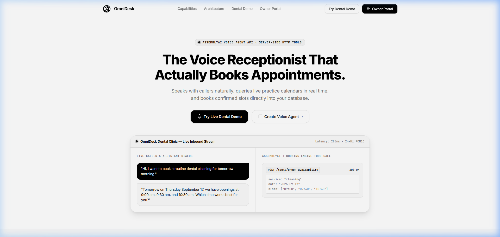
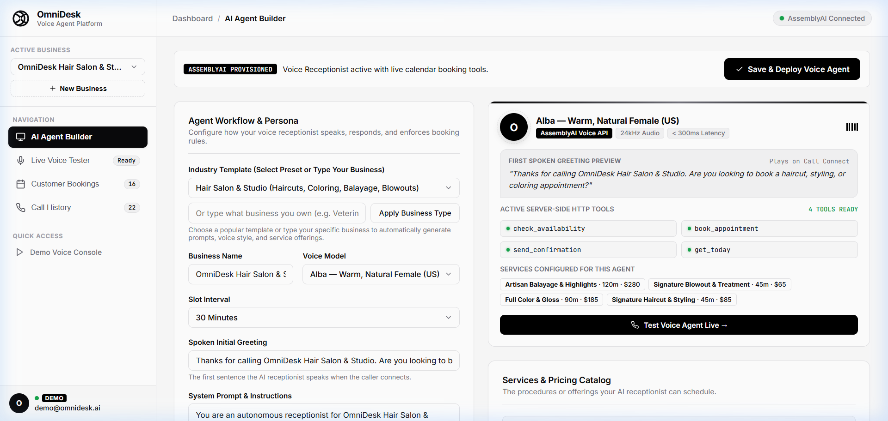
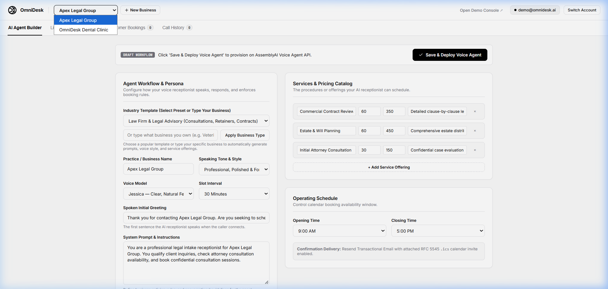
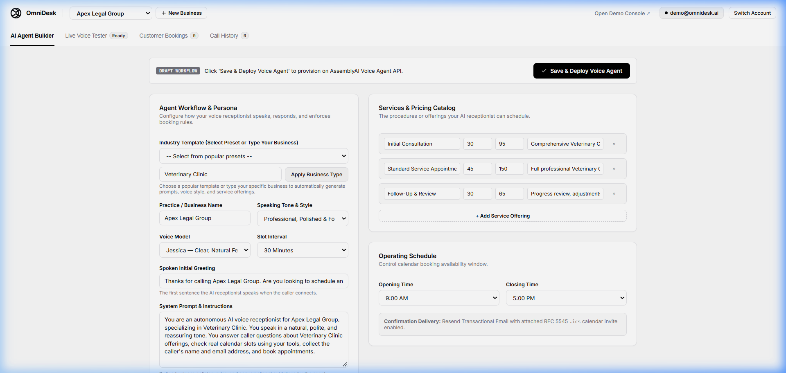
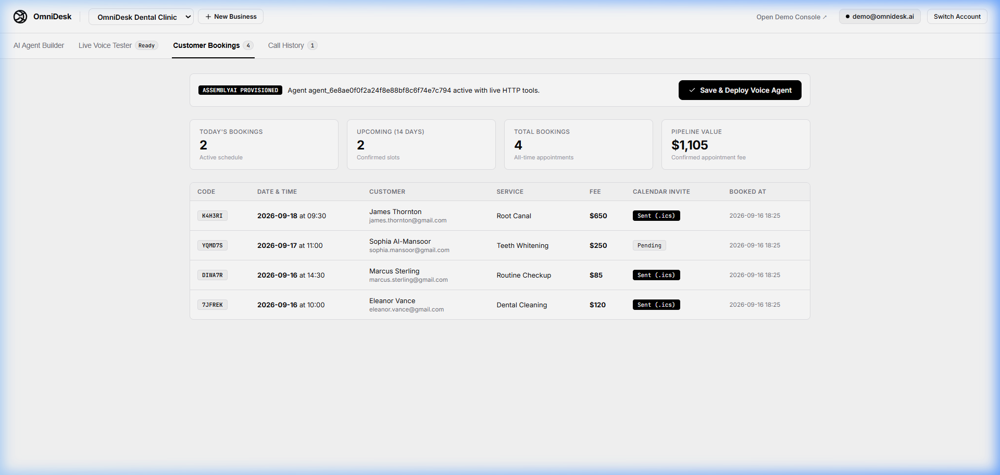
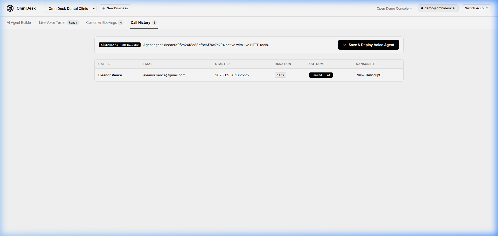
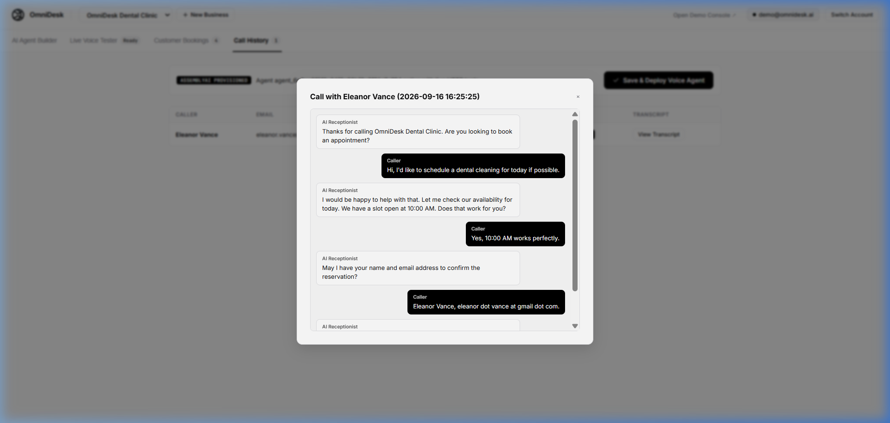
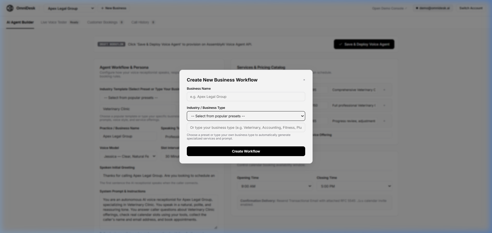

# OmniDesk — Autonomous Voice Receptionist & Practice Operating System

OmniDesk is an autonomous voice receptionist platform powered by the AssemblyAI Voice Agent API. It utilizes direct server-side HTTP tools to execute real-time calendar availability lookups, deterministic booking validation, and automated customer confirmation dispatches without requiring a persistent client-side tool dispatcher during the call.

The platform includes a curated, light-mode landing page designed under tasteskill.dev anti-slop principles, a live voice console with instant audio barge-in, an interactive tool inspector, and an Owner Console slide-over sheet engineered following Emil Kowalski and Better UI specifications.

---

## System Architecture

```text
                                      OMNIDESK PLATFORM
                                             |
                      +----------------------+----------------------+
                      |                                             |
                 BUSINESS OWNER                                  CUSTOMER
                      |                                             |
                      v                                             v
             Create & Setup Practice                      Web Voice / Inbound Call
                      |                                             |
                      v                                             v
             Configure AI Agent ----------------------------> AssemblyAI Voice Agent
             (Hours, Services, Knowledge)                   (Real-time Audio Stream)
                      |                                             |
                      |                                             v
                      |                                        Conversation
                      |                                     (Intent, Date, Slot)
                      |                                             |
                      |                                             v
                      |                                      Booking Request
                      |                                    (Service, Date, Email)
                      |                                             |
                      +---------------------------------------------+
                                                    |
                                                    v
                                         Server-Side HTTP Tools
                                    (/check_availability, /book_appointment)
                                                    |
                                                    v
                                              Booking Engine
                                        (Slot Lock & Conflict Check)
                                                    |
                                                    v
                                                Database
                                                    |
                      +-----------------------------+-----------------------------+
                      |                                                           |
                      v                                                           v
             Owner Dashboard Sheet                                      Customer Confirmation
            (Real-Time Calendar, KPI                                  (Resend Transactional Email
             Metrics, Customer Directory)                               + Attached .ics Invite)
```

---

## Visual Platform Walkthrough

### 1. Public Landing Page & Voice Interface


Designed under anti-slop aesthetic principles with a viewport-fitted hero, interactive live dialogue simulator, architecture bento grid, and direct access to both the interactive live voice console and SaaS Owner Portal.

---

### 2. Multi-Tenant AI Voice Agent & Workflow Builder


Business owners configure custom AI receptionists with industry presets (Dental, MedSpa, Law Firm, Salon, Auto Repair, Real Estate) or any custom enterprise type. Directly tune voice models (AssemblyAI Jessica, George, Alice, River), speaking tones, initial greetings, system prompts, phonetic boost keyterms, and service catalogs.

---

### 3. Dynamic Multi-Tenant Switching (e.g. Apex Legal Group)


Seamless tenant switching: changing practices dynamically updates industry templates, legal service catalogs, prompt instructions, and caller greetings without state pollution.

---

### 4. Custom Any-Business Provisioning (e.g. Veterinary Clinic)


Owners can type any custom business (such as a Veterinary Clinic or Fitness Gym) and OmniDesk automatically synthesizes tailored initial greetings, specialized system prompts, consultation service items, and scheduling intervals.

---

### 5. Sheeted Customer Bookings CRM & Real-Time KPIs


Practice owners monitor high-level KPIs (Today's Bookings, Upcoming Appointments, All-Time Totals, Pipeline Revenue) and inspect confirmed appointments with confirmation codes, customer contacts, calendar delivery statuses, and pricing.

---

### 6. Call History Logs & Dialogue Transcripts




Every inbound call through the AssemblyAI Voice Agent API is logged with caller identity, duration, outcome, and full turn-by-turn conversational dialogue bubbles and server-side HTTP tool execution traces.

---

### 7. Instant Business Creation Modal


Add new business entities with real-time industry detection and automated workflow generation in seconds.

---

## Key Capabilities

- **Multi-Tenant SaaS Architecture**: Scalable business owner portal with industry presets, custom business builder, and dedicated multi-tenant database persistence.
- **Server-Side HTTP Tools**: AssemblyAI invokes backend endpoints directly over public HTTPS. The browser does not mediate or execute database transactions.
- **Sub-300ms Barge-In**: Audio input and output streams are processed concurrently. When the user starts speaking (`input.speech.started`), active playback buffers are discarded instantaneously via Web Audio API scheduling (`playHead = Math.max(playHead, audioCtx.currentTime)`).
- **Email Verification & Native Calendar Invites**: When a slot is confirmed, OmniDesk generates an RFC 5545 compliant `.ics` calendar invite with a 60-minute pre-appointment alarm notification and dispatches it through the Resend Transactional Email API with a branded HTML receipt.
- **Owner Portal & Live Voice Tester**: Embedded 24kHz bidirectional audio stream directly inside the business dashboard with live dialogue transcripts and tool execution inspectors.
- **Call History & CRM Bookings**: Comprehensive turn-by-turn transcript modals and sheeted appointment management with pipeline revenue and volume KPIs.

---

## Repository Structure

```text
assemblyai-voice-agent-scheduler/
|-- app/
|   |-- __init__.py
|   |-- main.py           # FastAPI application, multi-tenant HTTP tools, Resend email & .ics generation
|   |-- db.py             # Multi-tenant SQLite database persistence layer (owners, businesses, bookings, logs)
|   |-- store.py          # Demo scheduling engine, booking state, and event logger
|-- docs/
|   |-- images/           # Platform screenshots & UI walkthrough assets
|-- scripts/
|   |-- create_agent.py   # Provisions or updates the agent definition on AssemblyAI
|-- web/
|   |-- index.html        # Public landing page (tasteskill aesthetic)
|   |-- dashboard.html    # Business Owner SaaS Portal & Voice Agent Builder
|   |-- dashboard.js      # Multi-tenant SaaS client, Cute Dropdown system, and live simulator
|   |-- console.html      # Voice receptionist workspace and Owner Console sheet
|   |-- app.js            # AudioWorklet client, WebSocket handler, and sheet logic
|   |-- worklet.js        # PCM16 to Float32 linear audio converter worklet
|-- agent.json            # AssemblyAI agent specification, voice settings, and HTTP tool schemas
|-- requirements.txt      # Python dependencies (FastAPI, Uvicorn, HTTPX, Pydantic, etc.)
|-- .env.example          # Environment variable template
```

---

## Prerequisites

- Python 3.10 or higher
- AssemblyAI API Key ([AssemblyAI Dashboard](https://www.assemblyai.com/dashboard))
- Resend API Key ([Resend Dashboard](https://resend.com/))
- Supabase Project URL & Anon Key ([Supabase Dashboard](https://supabase.com/dashboard)) *(Optional: built-in local session fallback enabled if omitted)*
- Public HTTPS tunnel utility (Cloudflare Tunnel `cloudflared` or `ngrok`)

---

## Configuration

Create your `.env` configuration file from the provided template:

```bash
cp .env.example .env
```

Populate the required environment variables:

```env
# AssemblyAI Credentials
ASSEMBLYAI_API_KEY=your_assemblyai_api_key_here

# Stored Agent Identifier (populated after create_agent.py runs)
AGENT_ID=agent_xxxxxxxxxxxxxxxxxxxxxxxxxxxxxxxx

# Public HTTPS URL where AssemblyAI can reach your HTTP tools
# (Updated whenever you launch a new tunnel session)
PUBLIC_API_BASE_URL=https://your-tunnel-subdomain.trycloudflare.com

# Resend Transactional Email Credentials
RESEND_API_KEY=re_xxxxxxxxxxxxxxxxxxxxxxxxxxxxxxxx
RESEND_FROM_EMAIL=onboarding@resend.dev

# Supabase Auth Configuration (Business Owner Authentication)
# (Optional: defaults to seamless local owner auth session if left blank)
SUPABASE_URL=https://your-project.supabase.co
SUPABASE_ANON_KEY=eyJhbGciOi...your_anon_key_here
```

---

## Local Development & Deployment

### 1. Install Dependencies

```bash
# Create virtual environment
python -m venv .venv

# Activate on Windows
.venv\Scripts\activate

# Activate on macOS / Linux
source .venv/bin/activate

# Install required packages
pip install -r requirements.txt
```

### 2. Start the Backend Server

Launch the FastAPI application on port 8000:

```bash
uvicorn app.main:app --host 127.0.0.1 --port 8000 --reload
```

Verify service health:

```bash
curl http://127.0.0.1:8000/health
```

### 3. Expose the API to AssemblyAI

Because AssemblyAI executes tool calls directly from its cloud infrastructure, your local backend must be publicly reachable over HTTPS.

#### Using Cloudflare Tunnel (Recommended)

```bash
cloudflared tunnel --url http://localhost:8000
```

Copy the generated URL (e.g. `https://slides-mpg-sample-awesome.trycloudflare.com`) and update `PUBLIC_API_BASE_URL` in `.env`.

#### Using ngrok

```bash
ngrok http 8000
```

Copy the HTTPS forwarding address and update `PUBLIC_API_BASE_URL` in `.env`.

### 4. Provision or Update the Voice Agent

Register the agent with AssemblyAI:

```bash
python scripts/create_agent.py
```

If you have an existing agent ID, update the agent definition and tool URLs:

```bash
python scripts/create_agent.py --update <agent_id>
```

The script points all 4 HTTP tools (`get_today`, `check_availability`, `book_appointment`, `send_confirmation`) to your active public tunnel URL.

### 5. Access the Web Applications

- **Public Landing Page**: Navigate to `http://localhost:8000/`
- **Voice Receptionist Console**: Navigate to `http://localhost:8000/console` (or click "Launch OmniDesk Voice Console" on the landing page)
- **Owner Dashboard Sheet**: Click the "Owner Dashboard" button in the upper-right corner of the console to view the slide-over practice management sheet.

---

## HTTP Tool Specifications

AssemblyAI calls these endpoints directly during conversational turns:

| Endpoint | Method | Input Parameters | Output Summary |
| :--- | :--- | :--- | :--- |
| `/tools/get_today` | POST | None | System date, current weekday, and next 3 open clinic days to eliminate date hallucinations. |
| `/tools/check_availability` | POST | `service`: string<br>`date`: YYYY-MM-DD | Practice hours check and open 30-minute booking slots for the requested date. |
| `/tools/book_appointment` | POST | `service`: string<br>`date`: YYYY-MM-DD<br>`time`: HH:MM<br>`customer_name`: string<br>`email`: string | Slot reservation, conflict avoidance, and generation of a unique 6-character confirmation code. |
| `/tools/send_confirmation` | POST | `confirmation_code`: string | Dispatches an HTML booking receipt with an RFC 5545 `.ics` calendar attachment via Resend. |

---

## Transactional Email & Calendar Sync (.ics)

When an appointment is finalized, OmniDesk automatically formats an RFC 5545 compliant calendar object:

- **Organizer / Clinic**: OmniDesk Dental Clinic
- **Start / End Timestamp**: Calculated from service duration (30 min to 90 min)
- **Valarm Trigger**: `-PT60M` (Triggers native device notifications 1 hour before appointment)
- **Attachment Encoding**: Base64 `.ics` attachment delivered through Resend REST API (`POST https://api.resend.com/emails`)

Patients receive a clean transactional confirmation in their inbox and can tap the `.ics` file to add the reservation directly to Google Calendar, Apple Calendar, or Microsoft Outlook.

---

## License

MIT License.
